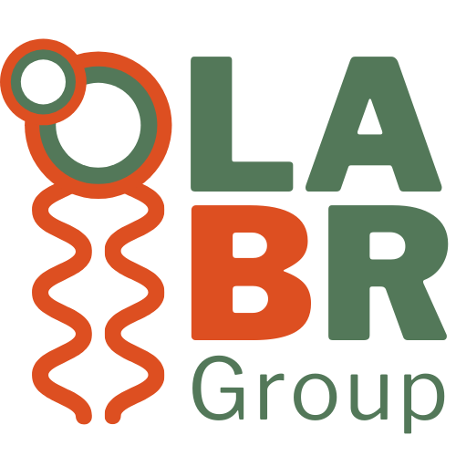
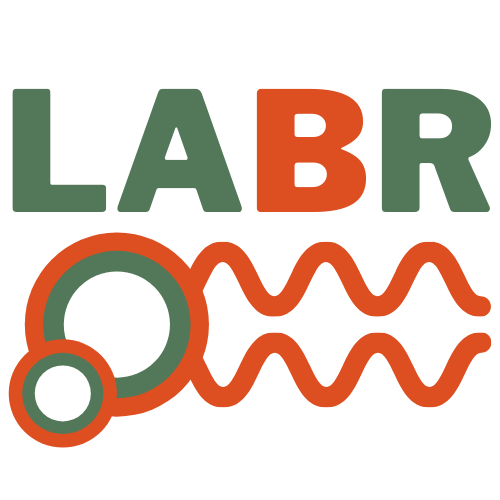
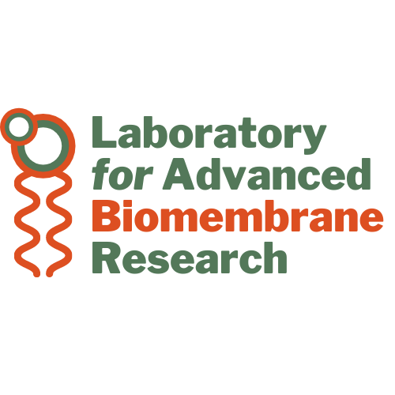

# logos-and-branding

Logos and branding info for the LABR Group

## Colour Codes

Below are the hex codes for the various "WCC Colours":  
-  `#dd4f21`
-  `#537859`

### Copy-and-paste

Feel free to copy and paste the images here for easy access  

| Style 1 | Style 2 | Style 3 |  
| :--------: | :--------: | :--------: |  
|  |  |  |  

<!-- | Logo1 SVG | Logo2 SVG |  
| :--------: | :--------: |  
|  |  |   -->